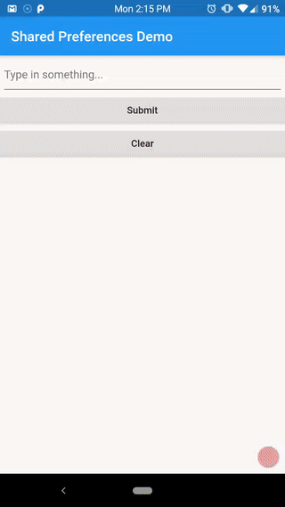

# shared_preferences_demo_app

A Flutter application demonstrating the Shared Preferences feature of Flutter which is a persistent store for data that makes use of the SharedPreferences plugin on Android and the NSUserDefaults plugin for iOS devices. Data is persisted to disk is key, value format and is asynchronus.

